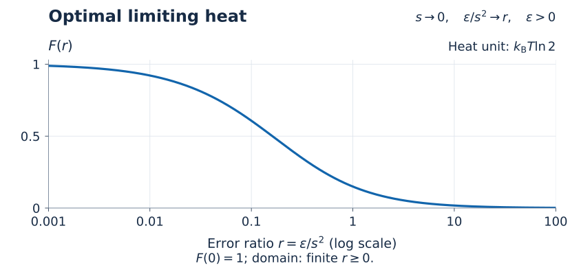

# Precision and Heat in Quantum Operations

**How accurately must a quantum device reproduce its outputs before a finite heat cost becomes unavoidable?**

A device receives either of two orthogonal qubit states and must produce the corresponding prescribed output. The outputs are almost orthogonal, so their average entropy changes very little. Yet requiring sufficiently accurate outputs on **each input** forces a finite environmental information record. When internal workspace is returned, this also forces a finite mean heat cost. This repository gives the physical model, a universal lower bound, a matching limiting construction, and runnable finite examples.

**Manuscript preparation is currently on hold.** Researchers interested in collaborating on this project are welcome to contact **Ruge Lin** at **[gogoko699@gmail.com](mailto:gogoko699@gmail.com)**.

## Physical task

The inputs are $`|0\rangle`$ and $`|1\rangle`$, each supplied with probability one half. The same apparatus must work for either input; the control receives no separate label. The desired pure output density operators are

```math
\phi_x(s)=\frac{I-sX+(-1)^x cZ}{2}.
```

Here $`x\in\{0,1\}`$, $`X`$ and $`Z`$ are Pauli matrices, $`c=\sqrt{1-s^2}`$, and $`0<s<1`$. Their state-vector overlap has magnitude $`s`$. The actual conditional output $`\sigma_x`$ must pass both tests:

```math
\frac12\|\sigma_x-\phi_x(s)\|_1\le\epsilon.
```

The targets share transverse polarization $`-s`$, while their longitudinal polarizations have opposite signs. Their average is $`(I-sX)/2`$. As $`s`$ tends to zero, this average approaches the maximally mixed input average. An entropy bound based only on the average state therefore tends to zero. The conditional task retains information that this average-state calculation leaves out.

## Main result

Measure heat in bit-erasure units, $`q=Q/(k_{\mathrm B}T\ln2)`$. Let $`q_{\min}(s,\epsilon)`$ be the infimum over the finite devices in the [physical model](docs/MODEL.md), with exact return of the workspace's ensemble-average marginal. The optimal limiting heat depends on the ratio of error to **squared** overlap:

```math
\lim_{\substack{s\to0\\\epsilon/s^2\to r}}
q_{\min}(s,\epsilon)=F(r).
```

For each finite $`r\ge0`$, define

```math
b_*(r)=(1+4r)^{-1/2},
\qquad
F(r)=1-h_2\!\left(\frac{1+b_*(r)}{2}\right).
```

The binary entropy $`h_2`$ is measured in bits. Every finite stage has **positive error**, including sequences approaching $`r=0`$. In that high-precision limit, $`F(0)=1`$: a full bit-erasure unit survives even as the average-state entropy loss vanishes. At $`r=1`$, the limiting heat is about $`0.149510`$ units.



Optimal limiting law computed from `qph.core.crossover`. The logarithmic axis shows positive finite ratios; the endpoint is $`F(0)=1`$. Each point specifies a joint small-overlap, positive-error limit, rather than a finite-device optimum. [Figure source](scripts/make_figures.py).

The [theorem](docs/THEOREM.md) gives the complete finite bound before taking the limit. The [proof](docs/PROOF.md) covers arbitrary finite Gibbs reservoirs and input-independent workspace states. The [thermal construction](docs/CONSTRUCTION.md) supplies the matching upper limit using a bath qubit followed by charged recovery swaps. Each implementation is finite; its bath size and energy gaps may grow along the optimizing sequence. The result identifies an **infimum**, without asserting an attained finite optimum.

## A finite comparison

Fix $`s=0.05`$ and use the same targets for both accuracy requirements:

| Conditional error tolerance | Heat in bit-erasure units |
|---|---|
| $`\epsilon=0.0001`$ | Every allowed cyclic device has $`q\ge0.498044`$. |
| $`\epsilon=0.0025`$ | One explicit bath-qubit device has $`q\simeq0.311485`$. |

The relaxed device retains the intended transverse polarization exactly. Its direct energy calculation already establishes this separation, without recovery. The first number is a proved lower bound; the second is the calculated heat of one construction. Neither is an experimental measurement or an exact finite optimum. The [finite benchmark](docs/FINITE_BENCHMARK.md) gives the parameters, return correction, and reference values.

## Resource accounting

Heat is the mean energy increase of the **complete thermal reservoir**, including all fresh Gibbs systems used for recovery. The input, workspace, and reservoir start independently. Workspace can be nonthermal, but any increase in its entropy must be charged. For the cyclic optimum its ensemble-average marginal is restored exactly; final correlations are permitted.


The accounting is for one use. Returning a workspace marginal does not by itself establish independent reuse on arbitrary future inputs. [Diagram source](scripts/make_figures.py).

Predetermined external driving is allowed. Under the [boundary Hamiltonian conditions](docs/MODEL.md), heat equals mean supplied work. Controller construction and source preparation lie outside this accounting. The result concerns a conditional quantum operation, with no hardware performance or wall-plug energy estimate attached to it.

## Reading paths

Specialists can go directly to the formal statement and its dependencies:

- **Physical model:** [task, resources, and heat ledger](docs/MODEL.md), with a [notation reference](docs/NOTATION.md).
- **Main result:** [finite bounds and optimal crossover](docs/THEOREM.md).
- **Proof:** [linked lemmas and complete argument](docs/PROOF.md), or the [claim-to-evidence map](docs/CLAIMS.md).
- **Thermal implementation:** [collision and recovery](docs/CONSTRUCTION.md), then the [finite comparison](docs/FINITE_BENCHMARK.md).
- **Relation to existing results:** [direct comparisons](docs/RELATED_WORK.md), [assumption register and primary sources](docs/LITERATURE.md).

For a teaching route, start with the [tutorial and textbook reading map](docs/tutorial/README.md). Its single educational anchor is Benjamin Schumacher and Michael D. Westmoreland, *Quantum Processes, Systems, and Information* (Cambridge University Press, 2010). The route develops conditional states, the finite device's energy balance, and the two precision scales before explaining the additional information inequalities needed for the universal converse.

## Reproduce

Run from the repository root with Python 3.11 or later:

```bash
python -m venv .venv
source .venv/bin/activate
python -m pip install -r requirements.txt
python -m unittest discover -s tests -v
python scripts/reproduce.py
```

On Windows PowerShell, activate with `.venv\Scripts\Activate.ps1`. The calculation writes a separate generated result and preserves the committed [reference record](results/reference.json). The [reproducibility guide](docs/REPRODUCIBILITY.md) gives package installation, documentation checks, figure regeneration, numerical domains, and tested environments.

## Contact and collaboration

For collaboration, questions, corrections, suggestions, or any other inquiry about this project, please email **Ruge Lin** at **[gogoko699@gmail.com](mailto:gogoko699@gmail.com)**. For a correction, include the relevant page or passage and a brief explanation.

Original code and documentation use the [MIT License](LICENSE), copyright 2026 Ruge Lin. Retain applicable third-party notices; scientific citations are scholarly attribution, not an added license condition. See [citation metadata](CITATION.cff) and the [source inventory and AI-assistance disclosure](provenance/README.md).
